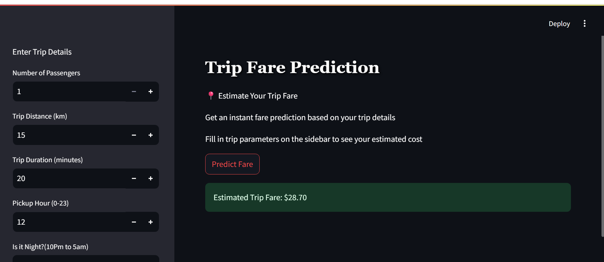

# Trip_Fare Prediction 🚕

## 📌 Overview

TripFare is a machine learning project that estimates taxi fares based on trip data.
Users provide details like distance, duration, time-of-day, and ride attributes — then the system returns a predicted fare instantly via a Streamlit interface.

## ⚙️ Features & Highlights

1. Cleaned, explored, and preprocessed real-world taxi trip data

2. Handling Outliers.

3. Engineered features: log transformations, night indicator, AM/PM flag, pickup hour, etc.

4. Built and compared multiple regression models (Linear,Ridge, Lasso, Random Forest, Gradient Boosting)

5. Tuned hyperparameters and selected the best-performing model

6. Saved the final model (pickle or joblib)

## 🧩 Metrics & Model Comparison

| Model                | R²      | MSE      | RMSE     | MAE       |
|----------------------|---------|-----------|-----------|------------|
| Linear Regression     | 0.9319  | 0.01507   | 0.12277   | 0.07477    |
| Ridge Regression      | 0.9319  | 0.01507   | 0.12277   | 0.07477    |
| Lasso Regression      | 0.7337  | 0.05895   | 0.24279   | 0.18931    |
| Gradient Boosting     | 0.9655  | 0.00763   | 0.08738   | 0.05293    |
| Random Forest (Best)  | 0.9667  | 0.00738   | 0.08589   | 0.04971    |

--> here i have pickled the Random Forest Model for my prediction which gives 96% Accuracy.

7. Developed a Streamlit app for user inputs and real-time fare prediction

